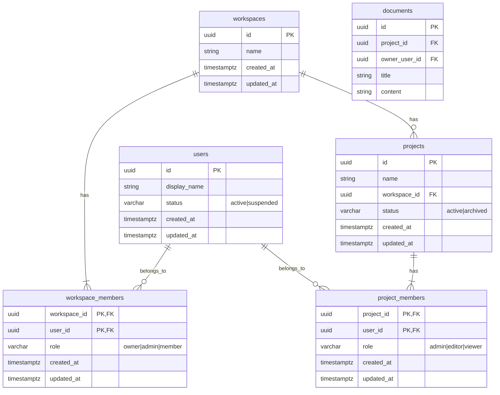

ER図
---

```mermaid
erDiagram
  users {
    uuid  id PK
    string display_name
    varchar status "active|suspended"
    timestamptz created_at
    timestamptz updated_at
  }

  workspaces {
    uuid id PK
    string name
    timestamptz created_at
    timestamptz updated_at
  }

  workspace_members {
    uuid workspace_id PK, FK
    uuid user_id PK, FK
    varchar role "owner|admin|member"
    timestamptz created_at
    timestamptz updated_at
  }

  projects {
    uuid id PK
    string name 
    uuid workspace_id FK
    varchar status "active|archived"
    timestamptz created_at
    timestamptz updated_at
  }

  project_members {
    uuid project_id PK, FK
    uuid user_id PK, FK
    varchar role "admin|editor|viewer"
    timestamptz created_at
    timestamptz updated_at
  }

  documents {
    uuid id PK
    uuid project_id FK
    uuid owner_user_id FK
    string title 
    string content
  }


  users ||--o{ workspace_members : belongs_to
  workspaces ||--|{ workspace_members : has

  workspaces ||--o{ projects : has
  projects ||--|{ project_members : has
  users ||--o{ project_members : belongs_to
```
