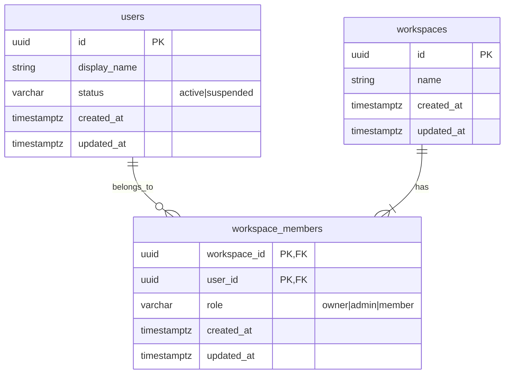

ER図
---

```mermaid
erDiagram
  users {
    uuid  id PK
    string display_name
    varchar status "active|suspended"
    timestamptz created_at
    timestamptz updated_at
  }

  workspaces {
    uuid id PK
    string name
    timestamptz created_at
    timestamptz updated_at
  }

  workspace_members {
    uuid workspace_id PK, FK
    uuid user_id PK, FK
    varchar role "owner|admin|member"
    timestamptz created_at
    timestamptz updated_at
  }

  users ||--o{ workspace_members : belongs_to
  workspaces ||--|{ workspace_members : has
```
